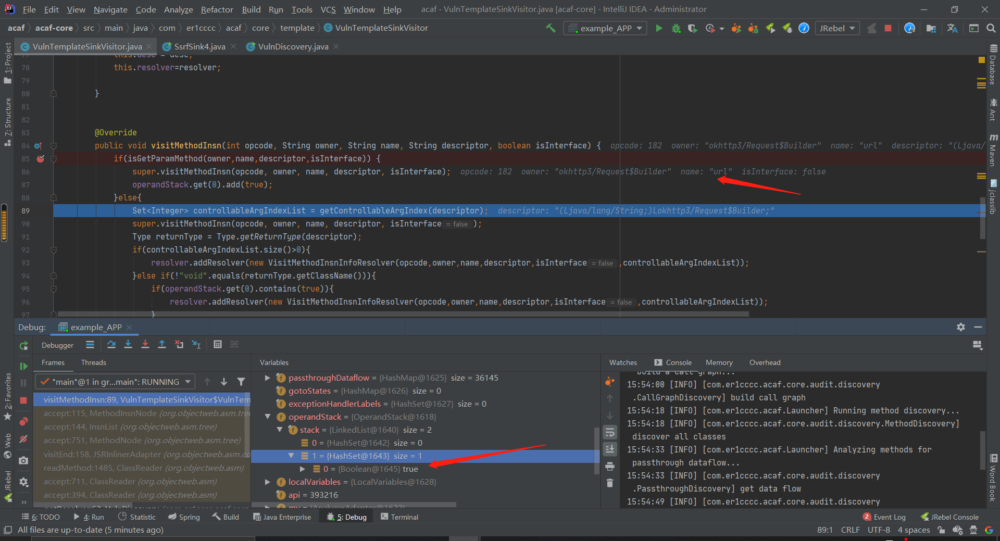

#  前言

笔者最近在研究java自动化代码审计这方面的内容，也看了一些相关的文章，其中主要是跟着[4ra1n师傅](https://4ra1n.love)的文章进行学习的。目前学到的有两种自动化审计思路，一是AST，二是ASM。前者基于java源代码，后者基于字节码。个人感觉后者的可操作性会更强一些。同时由于有[gadget-inspector](https://github.com/JackOfMostTrades/gadgetinspector)的铺垫，给我们提供了**使用java代码模拟jvm执行字节码**的思路，导致ASM这种自动化审计思路可以做到一定程度的动态化，实现了污点的动态流动，而不仅仅是停留在静态的代码层面。这也使得ASM这种思路更加具有可玩性。因此，笔者也选择了基于ASM来实现**ACAF(Auto Code Audit Framework)**。

在正式介绍之前，还是想先梳理一下笔者学习ASM自动化审计的过程。

最开始，笔者先入手的是[gadget-inspector](https://github.com/JackOfMostTrades/gadgetinspector)源码阅读，有一定的jvm基础，加上[三梦师傅](https://xz.aliyun.com/t/7058#toc-6)讲解的非常清晰的博客，花了几天把源码啃得七七八八了。

紧接着就开始跟着4ra1n师傅的博客学，学了一下他的[CodeInspector的实现](https://4ra1n.love/post/zA8rsm1ne/#%E6%80%BB%E7%BB%93)，以及[基于污点分析的JSP Webshell检测](https://4ra1n.love/post/0GeHo6Oj0/)，后者可能跟本文不是直接相关，不过**使用java代码模拟jvm执行字节码**这种思路都是一样的。

值得一提的是，CodeInspector是基于gadget-inspector进行实现的，二者的区别在于，CodeInspector是针对springboot项目的自动化审计，而gadget-inspector是专门用来找反序列化链的。

4ra1n师傅在实现CodeInspector的时候，是以SSRF的例子来进行实现的，需要我们自行去分析**常见导致SSRF的字节码**，然后把这种特征硬编码到程序当中，才能实现检测。于是笔者就思考了一下能否将这个过程自动化，或者说，让这个工具的使用更加简单一些。于是笔者将CodeInspector进行了一定程度的抽象，写了个**ACAF**。最终实现的效果就是，用户仅仅需要提供**漏洞代码的demo**，然后**手动将部分污点传播链路链接起来**，就能实现自动化代码审计。

接下来，笔者将从**使用方法、框架整体概览、漏洞代码特征抽取、手工链接污点传播链路、自动化审计、实际效果**六个方面来对ACAF进行分析（前面说了一堆废话

# 使用方法

以ssrf的例子来说，用户只需要给出会造成ssrf漏洞的常见demo，如下，将漏洞demo写在`sinkMethod`方法中

```java
package com.er1cccc.acaf.example.ssrf;

import com.er1cccc.acaf.config.ControllableParam;
import com.er1cccc.acaf.config.PassthroughRegistry;
import com.er1cccc.acaf.config.Sink;
import okhttp3.OkHttpClient;
import okhttp3.Request;
import okhttp3.Response;

import java.lang.reflect.Method;

public class SsrfSink4 implements Sink {
    private ControllableParam params = new ControllableParam();

    public SsrfSink4(){
        params.put("url","http://localhost");
    }

    @Override
    public Object sinkMethod() throws Exception {
        OkHttpClient httpClient = new OkHttpClient();
        Request request = new Request.Builder().url((String) params.getParameter("url")).build();
        Response response = httpClient.newCall(request).execute();
        return null;
    }
}
```

然后将**手动将部分污点传播链路链接起来**（这部分在本文后面会详细讲解），实现`addPassthrough`方法，最终得到完整的demo代码

```java
public class SsrfSink4 implements Sink {
    private ControllableParam params = new ControllableParam();

    public SsrfSink4(){
        params.put("url","http://localhost");
    }

    @Override
    public Object sinkMethod() throws Exception {
        OkHttpClient httpClient = new OkHttpClient();
        Request request = new Request.Builder().url((String) params.getParameter("url")).build();
        Response response = httpClient.newCall(request).execute();
        return null;
    }

    @Override
    public void addPassthrough(PassthroughRegistry passthroughRegistry) {
        try{
            Class<?> builder = new Request.Builder().getClass();
            Method urlMethod = builder.getMethod("url",String.class);
            Method buildMethod = builder.getMethod("build");
            Class<OkHttpClient> okHttpClientClass = OkHttpClient.class;
            Method newCall = okHttpClientClass.getMethod("newCall", Request.class);
            Class<?> call = newCall.getReturnType();
            Method execute = call.getMethod("execute");

            passthroughRegistry.addPassthrough(urlMethod,1);
            passthroughRegistry.addPassthrough(buildMethod,0);
            passthroughRegistry.addPassthrough(newCall,1);
            passthroughRegistry.addPassthrough(execute,0);
        }catch (Exception e){
            e.printStackTrace();
        }
    }
}
```

然后写一个配置类

```java
package com.er1cccc.acaf.example.ssrf;


import com.er1cccc.acaf.config.*;

public class SSRFConfigurer implements ACAFConfigurer {
    @Override
    public void addSource(SourceRegistry sourceRegistry) {

    }

    @Override
    public void addSanitize(SanitizeRegistry sanitizeRegistry) {
    }

    @Override
    public void addSink(SinkRegistry sinkRegistry) {
        sinkRegistry.addSink(new SsrfSink4());
    }
}
```

最后创建配置类，开始审计

```java
package com.er1cccc.acaf.example;


import com.er1cccc.acaf.Launcher;
import com.er1cccc.acaf.example.sql.SqlConfigurer;
import com.er1cccc.acaf.example.ssrf.SSRFConfigurer;

public class App {
    public static void main( String[] args ) throws Exception{
        Launcher.launch(new SSRFConfigurer(),args);
    }
}
```

# 框架整体概览

最初笔者制定的框架结构图是长这个样子的。分别通过VulnTemplateSourceVisitor、VulnTemplateSanitizeVisitor、VulnTemplateSinkVisitor去观察用户给出的source、sanitizer和sink，分析字节码，抽取出特征，然后将特征保存到VulnDiscovery中，再由VulnDiscovery去完成审计功能。


然而，笔者在真正实现时发现，source和sanitize这部分可能不太有必要（灰色部分），因此就仅实现了sink的自定义。

先说说source为什么没有实现，一开始之所以规划了source、sanitizer和sink是因为想参考codeql，但是真正落到ACAF上发现，并没有必要去完全套用。codeql之所以提供了自定义source的功能，是因为它是一款针对多种编程语言，多种框架的普适性的代码审计工具，而ACAF的定位是仅仅针对spring web项目的审计。在codeql中，source可能是无穷无尽的，没办法限定死，而ACAF中，也就是在spring web的环境下，source比较局限，可以直接硬编码到框架中。

而sanitizer的话，是因为笔者在写这个框架过程中，暂时还没遇到过误报的情况，所以也感觉不太必要，因此就暂时没有实现。如果后续有这种需求，再考虑实现。

既然说到这里了，就稍微说说ACAF和codeql的区别。这也是笔者在实现这个框架之前思考过的一个问题，codeql已经做的非常出色了，我有没有必要再去重复造轮子？

## ACAF与codeql的区别

### 更加自动化

codeql需要使用者写ql语句对代码进行分析，需要一定的人工投入。而acaf仅需要用户给出项目的jar包/war包（未来可能扩充更多的形式）就能对项目进行常见漏洞的自动化审计，如果是特殊漏洞，用户需要给出漏洞的示例代码。这一点目前笔者仅仅给出了ssrf的几种示例demo，用来审计项目中是否存在ssrf漏洞。未来可能计划补充更多常见漏洞的demo，这样就能实现常见web漏洞的自动化审计。

**追问：**那直接用codeql写出一些常见漏洞的查询语句不是更好？
**答：**在使用codeql前需要投入一定的时间成本去学习codeql的文档，而且codeql的语句也较为复杂。而ACAF仅仅需要用户给出java编写的漏洞demo，使用起来更加简单

### 开源问题

目前已知codeql有个很致命的点就是只能对源代码进行分析，如果仅有jar包是没法分析的。虽然说可以把jar包进行反编译成源代码然后再进行分析，但是在反编译过程中可能会遇到项目依赖过于复杂，反编译十分困难，出现反编译后无法编译回去的情况。而ACAF本身就是对jar包（class文件）进行分析，所以不存在这方面的问题。

# 漏洞代码特征抽取

前面说了，使用CodeInspector的时候，需要我们**自行分析导致漏洞的字节码**，然后**自行找出漏洞字节码的特征**，将其硬编码到程序当中，才能实现检测。而**漏洞代码特征抽取**这部分要完成的功能就是，只需要用户**提供导致漏洞的java代码**，让框架**自动去分析它对应的字节码，提取出特征**。

明确了这部分的目的之后，来看看代码实现。主要代码逻辑在`com.er1cccc.acaf.core.template.VulnTemplateSinkVisitor`，由于框架给出了接口，要求用户如果想自定义sink需要写一个类来实现`com.er1cccc.acaf.config.Sink`接口，进而实现接口中的`sinkMethod`方法，将漏洞demo写到这个方法中。因此，我们在使用asm观察的时候，就只需要去关注这个`sinkMethod`方法就好

在`com.er1cccc.acaf.core.template.VulnTemplateSinkVisitor#visitMethod`中，如果观察到`sinkMethod`方法，则进一步去观察方法体，使用`com.er1cccc.acaf.core.template.VulnTemplateSinkVisitor.VulnTemplateSinkMethodVisitor`进行观察


对与`sinkMethod`的方法体，我们着重观察的是方法体中的方法调用指令，重写`visitMethodInsn`方法对其进行观察。其他的字节码指令我们交给父类`CoreMethodAdapter`去帮助我们模拟出JVM的操作，实现污点的传递。关于模拟JVM操作不太理解的可以先按照**前言**中笔者的学习路径，先去学一下前面的基础。


接下来看看`visitMethodInsn`方法的实现，首先调用了`isGetParamMethod`方法。这个方法的作用就是判断本次方法调用是不是准备调用**获取可控参数的方法**。

这里详细解释一下，我们让用户提供漏洞demo，但是我们并不知道漏洞demo中究竟哪些参数可控才能导致该漏洞，因此，与用户约定，可控的参数统一通过`params.getParameter`来进行获取

如下，`new Request.Builder().url()`方法的参数可控可以造成漏洞，因此我们通过`params.getParameter`来进行获取。

```java
public class SsrfSink4 implements Sink {
    private ControllableParam params = new ControllableParam();

    public SsrfSink4(){
        params.put("url","http://localhost");
    }

    @Override
    public Object sinkMethod() throws Exception {
        OkHttpClient httpClient = new OkHttpClient();
        Request request = new Request.Builder().url((String) params.getParameter("url")).build();
        Response response = httpClient.newCall(request).execute();
        return null;
    }
}
```

有了这样的约定之后，我们在观察`sinkMethod`方法体中的方法调用时，如果观察到了`params.getParameter`这样的方法调用，我们就能够知道这里存在一个可控的参数，因此我们可以在调用完`params.getParameter`方法之后，把操作数栈栈顶的返回值替换为taint（污点）。

回到`isGetParamMethod`方法，我们看看它的实现，实际上就是再判断是否在调用`params.getParameter`


如果是，就像笔者刚才说的那样，把操作数栈栈顶的返回值替换为taint，这里用布尔值true表示污点。到这里实际上我们就完成的污点的播种，接下来就考虑如何把污点传递的特征也给记录下来


我们看else逻辑，首先调用`getControllableArgIndex`获取可控参数的下标，可控参数等同于污点，就是当前操作数栈中为true的参数


看看`getControllableArgIndex`方法的实现


获取到可控的参数下标之后，调用了`super.visitMethodInsn`，这里就是在模拟JVM的执行过程。这行代码结束之后，操作数栈顶就是方法的返回值了。


接下来判断可控的参数列表是否为空，不为空则创建一个`VisitMethodInsnInfoResolver`并加入到`CompositResolver`中，算是提取到一个特征


如果为空，则继续判断方法返回值是否为空，如果不为空查看返回值是否是污点，是的话也创建一个`VisitMethodInsnInfoResolver`并加入到`CompositResolver`中，也算是提取到一个特征


理论终于扯完了，下面上案例来分析，就以上面给出的`SsrfSink4`demo类为例来看看实际的执行过程

```java
public class SsrfSink4 implements Sink {
    private ControllableParam params = new ControllableParam();

    public SsrfSink4(){
        params.put("url","http://localhost");
    }

    @Override
    public Object sinkMethod() throws Exception {
        OkHttpClient httpClient = new OkHttpClient();
        Request request = new Request.Builder().url((String) params.getParameter("url")).build();
        Response response = httpClient.newCall(request).execute();
        return null;
    }
}
```

第一次进入`com.er1cccc.acaf.core.template.VulnTemplateSinkVisitor.VulnTemplateSinkMethodVisitor#visitMethodInsn`是调用`OkHttpClient`的`<init>`方法，可以简单理解为是构造方法，不满足if条件，进入else


紧接着判断参数和返回值是否是taint，都不满足，因此什么也没做。


接下来看`sinkMethod`方法体中的第二个方法调用，是`okhttp3/Request$Builder.init`，跟上面一样，不是重点，直接跳过


第三个方法调用是`com/er1cccc/acaf/config/ControllableParam.getParameter`这就是重点了，根据前面的分析，85行的if满足，进入，然后86行先模拟方法执行，87行把方法返回值替换为taint。


继续看下一个方法调用，是`okhttp3/Request$Builder.url`，在调用`getControllableArgIndex`时，获取到参数0是可控的，也就是刚刚观察getParameter方法时，往操作数栈中放入的true。


由于存在可控参数，所以这里会创建一个`VisitMethodInsnInfoResolver`并加入到`CompositResolver`中。


这里有必要详细解释一下。所谓**漏洞代码特征抽取**，实际上就是从`params.getParameter`开始，播种污点，然后看污点随着方法的调用会传递到哪里去，在刚才的例子中，污点就传播到了`okhttp3/Request$Builder.url`方法中。

我们在观察`sinkMethod`的方法体时，需要将污点的传播路径给记录下来，记录到`CompositResolver`中，需要注意的是，这里在记录时是以`Resolver`的形式进行记录的。这里创建了一个`VisitMethodInsnInfoResolver`，然后传入了方法调用相关的信息，如方法名name，方法描述符descriptor等，同时还传入了方法调用可控的参数列表，这是为了后续在审计时，比对触发漏洞的方法需要的参数是否可控。

解释完继续回来看在`sinkMethod`方法体中的观察到的方法调用，下一个方法调用是`okhttp3/Request$Builder.build`，在这一步的时候会发现一个问题：**污点传播不下去了！**可控的参数列表为空，而且方法返回值也不是taint。


如果继续让程序继续执行，直到`sinkMethod`观察完毕，得到的结果就是，`CompositResolver`只记录到一个特征，就是触发漏洞需要调用`okhttp3/Request$Builder.url`方法，且第0个参数可控。这样很明显是会有问题的，特征提取的不够充分，会引起很严重的误报情况。


看下面这段代码，当url参数可控时，就会被误判成是sink。但是实际上它并不是，仅仅调用`httpClient.newCall(request)`是不会发起请求的，一定要调用`httpClient.newCall(request).execute()`才行。

```java
public String ssrf4_fake2(String url) {
    try {
        OkHttpClient httpClient = new OkHttpClient();
        Request request = new Request.Builder()
            .url(url)
            .build();
        httpClient.newCall(request);
        return "";
    } catch (Exception e) {
        e.printStackTrace();
        return e.getMessage();
    }
}
```

为什么会导致特征提取过少，实际上不难发现是因为污点没有传播下去，在`okhttp3/Request$Builder.build`这一步就断掉了。解决方法也简单，在下一节进行分析。

# 手工链接污点传播链路

上面说到了，污点传播是在`okhttp3/Request$Builder.build`这一步断掉的，这一节，我们主要看污点传播是怎么断的，怎么把它给接回去？

先看污点传播是怎么断的，我们回到刚刚断的地方，在`okhttp3/Request$Builder.build`这一步，看看此时的operandStack，发现其中居然没有了污点，我们刚刚观察`params.getParameter`的时候明明播种了污点，但是现在不见了


我们再回看一步，看`okhttp3/Request$Builder.url`方法，在执行这个方法之前，可以看到operandStack中是存在污点的，也就是观察`params.getParameter`的时候播种的污点，那为什么执行完`url`方法后准备执行`build`的时候就没了呢？不难想到，问题就出在`url`方法的执行过程中



我们跟入`url`方法的模拟执行过程，第90行。这里涉及到gadget-inspector的源码，不会说得很细，如果理解不了，可以先按照**前言**中笔者的学习路径，先去学一下前面的基础。我们直接看关键部分的代码

在这一步，会从passthrough中查出方法返回值与那个参数有关，查完发现，url方法的返回值与0号参数有关，也就是this，然后把this加入了resultTaint，最后将resultTaint中的值压入了operandStack。但是我们之前标记的污点是1号参数，就相当于污点在这个地方被无视掉了，也就造成了污点传播中断的现象。


可以看出，这种操作很明显是不太合理的，按照我们自己的分析，`url`方法的参数应该是与1号参数有关才对，也就是这里这个String类型的参数。但是gadget-inspector没有这么智能，存在一定的缺陷，所以需要我们人工修正这个passthrough。


到这里就基本知道了为什么污点传播会中断，就是因为gadget-inspector存在一定的局限性。接下来我们需要人工调整这个passthrough，让污点成功传递下去，调整方法很简单，原先我们在定义sink的时候需要重写`sinkMethod`给出sink方法的示例代码，现在我们只需要再重写一个`addPassthrough`方法就可以实现调整passthrough。针对上面污点传播中断的问题，笔者写了这样一段代码来解决（分析请看注释）

```java
public class SsrfSink4 implements Sink {
    private ControllableParam params = new ControllableParam();

    public SsrfSink4(){
        params.put("url","http://localhost");
    }

    @Override
    public Object sinkMethod() throws Exception {
        OkHttpClient httpClient = new OkHttpClient();
        Request request = new Request.Builder().url((String) params.getParameter("url")).build();
        Response response = httpClient.newCall(request).execute();
        return null;
    }

    @Override
    public void addPassthrough(PassthroughRegistry passthroughRegistry) {
        try{
            Class<?> builder = new Request.Builder().getClass();
            Method urlMethod = builder.getMethod("url",String.class);
            Method buildMethod = builder.getMethod("build");
            Class<OkHttpClient> okHttpClientClass = OkHttpClient.class;
            Method newCall = okHttpClientClass.getMethod("newCall", Request.class);
            Class<?> call = newCall.getReturnType();
            Method execute = call.getMethod("execute");
			//在static方法中下标0为方法第一个参数，在非static方法中，下标0为this，下标1才是方法的第一个参数
            //表示url方法的返回值与1号下标参数有关
            passthroughRegistry.addPassthrough(urlMethod,1);
            //表示build方法的返回值与0号下标参数(this)有关
            passthroughRegistry.addPassthrough(buildMethod,0);
            //表示newCall方法的返回值与1号下标参数(request)有关
            passthroughRegistry.addPassthrough(newCall,1);
            //表示execute方法的返回值与0号下标参数(this)有关
            passthroughRegistry.addPassthrough(execute,0);
        }catch (Exception e){
            e.printStackTrace();
        }
    }
}
```

在`addPassthrough`中，我们只需要调用`passthroughRegistry.addPassthrough`这个api即可完成passthrough的修正。经过这个修正之后，我们再来看看特征抽取的效果，回到刚刚污点断掉的地方`okhttp3/Request$Builder.url`，准备跟进`super.visitMethodInsn`


还是回到刚刚那个passthrough的地方，发现此时获取到的`passthroughArgs`就是我们调整过的了，现在程序就会认为`url`方法的返回值与1号参数有关（刚才是0号）。


接下来就会把1号参数，也就是taint给加入到`resultTaint`中


最后，把`resultTaint`中的污点压入到`operandStack`。这样一来，在`url`方法模拟执行这一步，我们成功让污点传播延续了下去。


后面的其他方法调用也是差不多的流程，这里不予赘述，直接看最终提取到的特征。可以看到，现在提取出了4个特征，并且需要哪些参数可控都列举的很清楚。例如`url`方法需要0号参数可控，`newCall`方法也需要0号参数可控。**注意，这里的下标与static没关系，无论是否是static方法，0号参数指的都是方法的第一个参数，不涉及到this。**

不难看出，现在的特征提取已经非常准确了，从`url`到最后的`execute`，避免了误报的情况


# 自动化审计

到了这一步之后，后面的代码就很好写了，有了漏洞特征，直接按照漏洞特征进行判断即可。我们选取controller方法的参数作为source，sink就是用户自定义的sink。根据前面提取的特征，看source是否能经过这样一段链路，这段链路中包含了从demo中提取出的所有特征。如果能，那就说明存在漏洞，反之说明不存在。

这个部分主要参考了[4ra1n师傅](https://4ra1n.love)的CodeInspector，将controller方法的参数作为source，然后使用dfs不断地向下追溯污点的传播，同时进行特征匹配，最终查看特征是否完全匹配来判断是否存在漏洞。详细分析请参考[基于GI的自动Java代码审计工具实现](https://4ra1n.love/post/zA8rsm1ne/#%E6%80%BB%E7%BB%93)

这里只分析我改动过的重点代码，在`com.er1cccc.acaf.core.audit.auditcore.VulnMethodAdapter#visitMethodInsn`，在观察方法体时，如果遇到方法调用的字节码，则使用前面收集到的漏洞特征进行匹配


跟进`vulnResolver.resolve`，发现`CompositResolver`实际上就是一个`Resolver`集合，调用它的`resolve`方法实际上就是在遍历它的`resolverList`进行特征匹配。


最终，如果`vulnResolver.resolve(null)`返回true，说明特征已经完全匹配上了，那么就输出调用栈


至此，ACAF的源码就介绍完毕了，最后看看实际效果

# 实际效果

笔者根据4ra1n师傅的[CIDemo](https://github.com/EmYiQing/CIDemo)项目，改了改，加上了很多fake sink，来测试误报，同时也写出了其中4个ssrf的demo


看结果，发现4个sink点都找出来了，而fake sink完全没有误报（这里笔者突然发现还有一处漏讲了，就是关于controller复杂参数类型的处理，这里笔者也对CodeInspector进行了优化，使其能够处理复杂类型参数，这里找出的ssrf1_url这个sink就是验证，不过原理有点写不动了，有兴趣的可以看看源码）


# 总结

（其实是个没有总结的总结

主要想感谢三梦师傅、4ra1n师傅以及gadget-inspector作者Ian Haken带我入了自动化审计这个坑，非常感谢！然后就是欢迎对这个项目感兴趣的师傅来一起讨论，希望可以完善更多常见漏洞的demo。

# 参考

> [gadget-inspector](https://github.com/JackOfMostTrades/gadgetinspector)
>
> [java反序列化利用链自动挖掘工具gadgetinspector源码浅析](https://xz.aliyun.com/t/7058#toc-0)
>
> [基于GI的自动Java代码审计工具实现](https://4ra1n.love/post/zA8rsm1ne/#%E6%80%BB%E7%BB%93)
>
> [基于污点分析的JSP Webshell检测](https://4ra1n.love/post/0GeHo6Oj0/)

